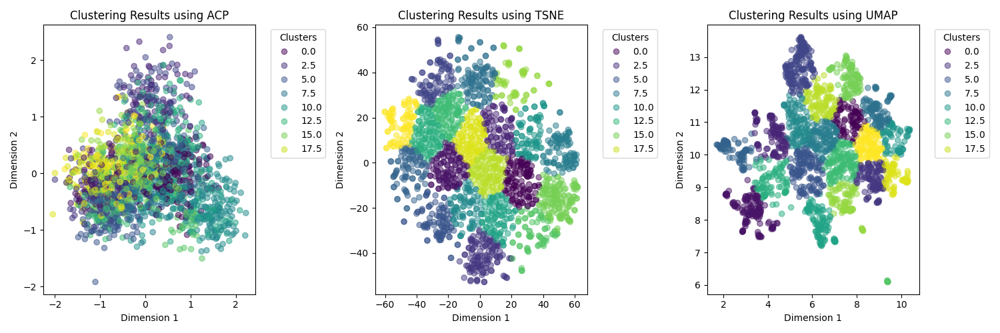

# Clustering avec réduction de dimension sur les données NG20

Le but de ce projet est de comparer plusieurs méthodes combinant la réduction de dimension et le clustering. Nous avons testés avec 3 méthodes de réduction de dimension : *ACP, **t-SNE* et *UMAP* (on retiendra un espace réduit de dimension 20 pour ACP et UMAP, de dimension 3 pour t-SNE). Comme méthode de clustering, nous avons opté pour *k-means*. 
Cette approche dite tandem ou séquentielle prend en entrée des données textuelles (les données NG20
comme présenté sur le template, on utilisera 2000 documents seulement), pour la représentation vectorielle des données textuelles, nous avons utilisé le modèle de langue [*Sentence Transformer*](https://huggingface.co/sentence-transformers).

L'objectif est de voir quelle combinaison donne les meilleurs résultats :

## Paramètres :
|   Modèle Sentence Transformer |     paraphrase-MiniLM-L6-v2     |
|      Dimension réduite        |    20 (ACP, UMAP), 3 (t-SNE)    |

## Evaluation des méthodes : 

|     Méthode     |    NMI    |    ARI    |
|-----------------|-----------|-----------|
|   ACP + k-means |    0.41   |   0.24    |
| t-SNE + k-means |    0.43   |   0.26    |
|  UMAP + k-means |    0.47   |   0.28    |

## Visualisation des résultats :

En exécutant le conteneur, Cette visualisation est sauvegardée dans une image "results.png"